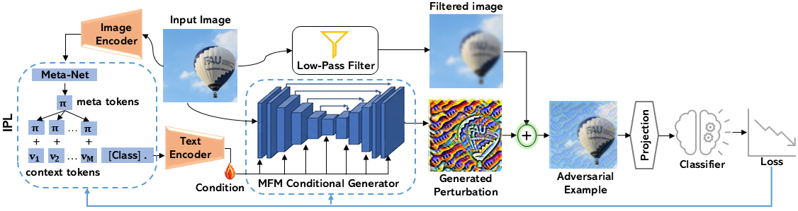

# ICGN: Instance-Conditioned Generative Network

ICGN is a generative framework for **transfer-based targeted adversarial attacks** that replaces weak, class-static conditioning with an **instance-adaptive semantic token** derived from CLIP. By integrating per-image context vectors into the generator via Multi-Depth modulation (MDM), ICGN achieves strong targeted transferability — even under severely limited training data — without any query access to the victim model.

**Overall Results:**
- 🎯 **+19.09 pp** average targeted success rate over the strongest baseline on ImageNet (325k training images)
- 🔥 **29.66% TSR** under extreme low-data conditions (10k images), while all prior methods collapse below 0.30%
- 🧠 Instance-conditioned via CLIP + learnable prompts + Multi-Depth modulation

---

## Overview



## Repository Structure

```
├── train.py                  # Unified training script (CIFAR-10 + ImageNet)
├── eval.py                   # Unified evaluation / generation script
├── inference.py              # Attack success rate measurement across models
├── generator.py              # MDMGenerator
├── prompt_learner.py         # CLIP-based Conditioner
├── utils.py                  # Models, normalization, data loading, class indices
├── imagenet_class_index.json
└── cifar10_class_index.json
```

---

## Installation

```bash
# 1. Clone the repo
git clone https://github.com/<your-username>/ICGN.git
cd ICGN

# 2. Create and activate the conda environment (Python 3.10, CUDA 11.8, PyTorch 2.2.1)
conda env create -f environment.yml
conda activate LP-LFGA

# 3. Install CLIP from OpenAI
pip install git+https://github.com/openai/CLIP.git
```
Requirements: NVIDIA GPU with CUDA 11.8+. The environment.yml pins all exact package versions used in our experiments (PyTorch 2.2.1, torchvision 0.17.1, timm 1.0.22, numpy 1.26.4, pandas 2.3.3).

## Quick Start

### Training

**CIFAR-10**
```bash
python train.py \
  --dataset cifar10 \
  --train_dir /data/cifar10_png/train \
  --model_type cifar10_resnet56 \
  --label_flag ALL \
  --epochs 10
```

**ImageNet — ResNet-50**
```bash
python train.py \
  --dataset imagenet \
  --train_dir /data/ImageNet/ILSVRC2012_img_train \
  --model_type res50 \
  --label_flag C50 \
  --epochs 10
```

**ImageNet — Inception-v3**
```bash
python train.py \
  --dataset imagenet \
  --train_dir /data/ImageNet/ILSVRC2012_img_train \
  --model_type incv3 \
  --label_flag N8 \
  --epochs 10
```

Checkpoints are saved to `checkpoints_{dataset}/{model_type}/model-{epoch}.pth` and `prompt-{epoch}.pth`.

### Generating Adversarial Examples

**CIFAR-10**
```bash
python eval.py \
  --dataset cifar10 \
  --data_dir /data/cifar10_png/test \
  --model_type cifar10_vgg19_bn \
  --label_flag ALL \
  --load_g_path checkpoints_cifar10/cifar10_resnet56/model-9.pth \
  --load_cond_path checkpoints_cifar10/cifar10_resnet56/prompt-9.pth \
  --val_txt Cifar_10_val.txt
```

**ImageNet**
```bash
python eval.py \
  --dataset imagenet \
  --data_dir /data/neurips2017_dev \
  --model_type incv3 \
  --label_flag N8 \
  --load_g_path checkpoints_imagenet/incv3/model-9.pth \
  --load_cond_path checkpoints_imagenet/incv3/prompt-9.pth
```

Generated images are saved to `results_{dataset}/gan_{label_flag}/{model_type}_t{class_id}/images/`.

---

### Measuring Attack Success Rate

```bash
# Against a single model
python inference.py \
  --dataset imagenet \
  --test_dir results_imagenet/gan_n8/incv3 \
  --model_t res50 \
  --label_flag N8

# Against all standard models
python inference.py \
  --dataset imagenet \
  --test_dir results_imagenet/gan_n8/incv3 \
  --model_t all \
  --label_flag N8

# Against CIFAR-10 classifiers
python inference.py \
  --dataset cifar10 \
  --test_dir results_cifar10/gan_all/cifar10_resnet56 \
  --model_t cifar \
  --label_flag ALL
```

---

## Key Arguments

### `train.py` / `eval.py`

| Argument | Default | Description |
|---|---|---|
| `--dataset` | `imagenet` | `cifar10` or `imagenet` |
| `--model_type` | `incv3` | Surrogate model (see table below) |
| `--label_flag` | `N8` | Class subset (see table below) |
| `--eps` | `16` | L∞ perturbation budget (pixels, divided by 255) |
| `--nz` | `16` | Noise dimension |
| `--k` | auto | Gaussian lowpass kernel size (2 for CIFAR-10, 4 for ImageNet) |
| `--clip_backbone` | `ViT-B/16` | CLIP backbone |
| `--n_ctx` | `16` | Number of learnable context tokens |
| `--batch_size` | auto | 128 for CIFAR-10, 8 for ImageNet |

### Supported Models

| Dataset | `--model_type` |
|---|---|
| CIFAR-10 | `cifar10_resnet56`, `cifar10_resnet44`, `cifar10_resnet32`, `cifar10_resnet20`, `cifar10_vgg19_bn`, `cifar10_vgg16_bn`, `cifar10_vgg13_bn` |
| ImageNet | `res50`, `res152`, `incv3`, `incv4`, `vgg16`, `googlenet`, `dense121` |

### Class Subsets (`--label_flag`)

| Dataset | Flag | # Classes |
|---|---|---|
| CIFAR-10 | `ALL` | 10 |
| ImageNet | `N8` | 8 |
| ImageNet | `C50`| 50 |

---

## Data Preparation

**CIFAR-10** — Convert the binary CIFAR-10 dataset to PNG folders organized by class:
```
cifar10_png/
  train/
    airplane/  automobile/  bird/  ...
  test/
    airplane/  automobile/  bird/  ...
  Cifar_10_val.txt   # <filename>,<label> per line
```

**ImageNet (NeurIPS 2017 dev set)** — Organize as:
```
neurips2017_dev/
  images/
    ILSVRC2012_val_00000001.png  ...
  images.csv    # columns: ImageId, TrueLabel, TargetClass
```
